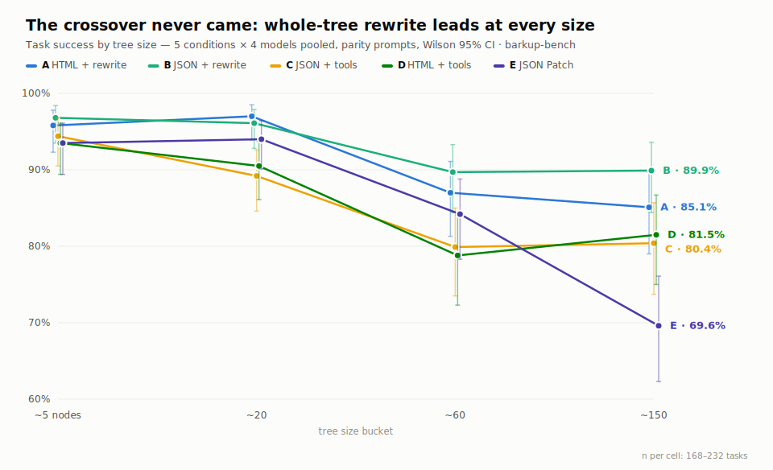
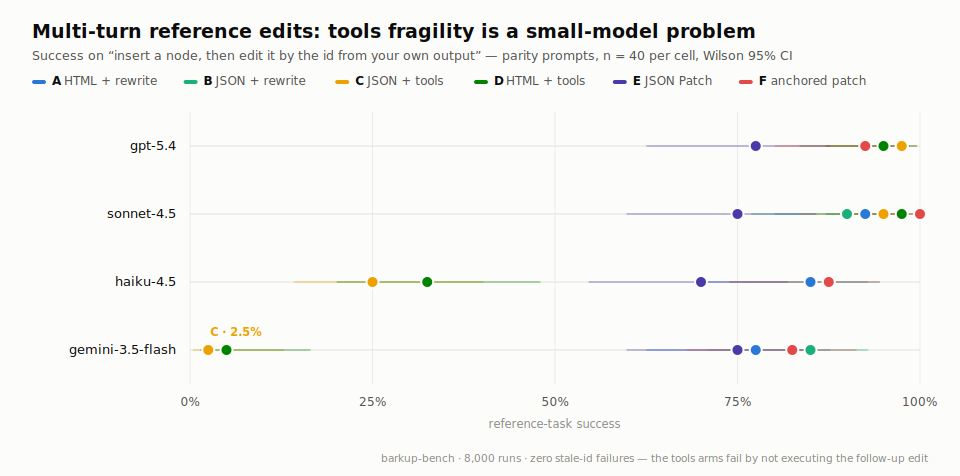

# barkup-bench

An ongoing, pre-registered benchmark series on a narrow question with
broad consequences: **what is the most reliable way to let an LLM
agent edit typed trees** (page layouts, document templates, CMS
content)? It began as a single study comparing the
[barkup](https://github.com/kevinpeckham/barkup) approach — HTML as
an authoring dialect, edited by whole-tree rewrite — against JSON +
granular mutation tools, and grew into nineteen studies covering
interfaces, tree size, partial context, retrieval, session memory,
and multi-target edits. Every utility in the
[`@kevinpeckham/barkup`](https://www.npmjs.com/package/@kevinpeckham/barkup)
package traces back to a study here.

**Status: active research series.** The main matrix and Studies F–S
are complete and published in [REPORT.md](REPORT.md); new studies are
added as results demand. Every study is pre-registered by commit
before its first scored run ([BRIEF.md](BRIEF.md) plus per-study
`docs/BRIEF-*.md`), gates are stated in advance, and results publish
whatever they show — the series so far includes one major correction
and three self-refutations, kept deliberately.

## The arc, in one paragraph

With correct conversation history, every id-stable editing interface
(whole-tree rewrite, mutation tools, id-anchored patches) performs
within a few points of the others at benchmark sizes — the dramatic
gaps we first reported were manufactured by a silent SDK history
defect (Study G, [vercel/ai#16840](https://github.com/vercel/ai/issues/16840)).
Above ~300 nodes only **id-anchored patches** hold for both model
tiers (H). Patches barely need to see the tree: a ~1.5k-token
**focused view** matches full-tree accuracy when the app knows the
target ids (I/J), a fresh view per turn keeps 12-edit sessions from
drifting (K), and when the app doesn't know the ids, a skeleton view
plus one **content-search tool call** grounds human-style requests at
oracle-level accuracy (L/N — navigation and off-the-shelf embeddings
both fail there). Sessions turn out not to need memory at all: two
canned **worked examples** in the system prompt replace conversation
history outright (M/O/P), a result that holds through 36-edit
sessions at 5 to 6× less input than keeping history (S). The honest boundary is **fan-out** ("change
every X inside Y"): one prompt asking for N edits delivers roughly
half of N under every strategy tested — the fix is app-side
**decomposition** into single-target edits, which measured 90/90
tasks with 674/674 subtasks (Q/R).

## Study index

| Study | Question | Answer | Brief |
|---|---|---|---|
| Main (A–E) | Rewrite vs tools vs patches, HTML vs JSON | Parity under corrected history; format is accuracy-neutral | [BRIEF.md](BRIEF.md) |
| F | Id-anchored patches | Match rewrite at the lowest cost measured | [BRIEF-F](docs/BRIEF-F.md) |
| G | The original gaps | An SDK history footgun, not the interfaces | [BRIEF-G](docs/BRIEF-G.md) |
| H | 300–1000 nodes | Crossover found: anchored patches only | [BRIEF-H](docs/BRIEF-H.md) |
| I/J | Focused views (JSON/HTML) | Free when ids are known; scale with depth, not size | [BRIEF-I](docs/BRIEF-I.md) · [BRIEF-J](docs/BRIEF-J.md) |
| K | 12-edit sessions | Fresh view per turn: no drift, cheapest policy | [BRIEF-K](docs/BRIEF-K.md) |
| L | Grounding without ids | Full-tree read costs 7–9 pp; navigation is a trap; lexical floor 60% | [BRIEF-L](docs/BRIEF-L.md) |
| M | Stateless sessions | Refuted — history contributed something | [BRIEF-M](docs/BRIEF-M.md) |
| N | The retrieval ladder | One search-tool call = oracle-level grounding; embeddings add nothing | [BRIEF-N](docs/BRIEF-N.md) |
| O | Positional views | Positions don't rescue statelessness — not arithmetic | [BRIEF-O](docs/BRIEF-O.md) |
| P | Synthetic history | Two worked examples replace the whole conversation | [BRIEF-P](docs/BRIEF-P.md) |
| Q | Fan-out edits | Break every strategy, even oracle retrieval; models invert | [BRIEF-Q](docs/BRIEF-Q.md) |
| R | Fan-out fixes | Prompt tricks fail; decomposition is perfect (90/90, ⅓ cost) | [BRIEF-R](docs/BRIEF-R.md) |
| S | 36-edit sessions | Both surviving recipes hold; stateless wins at 5–6× less input | [BRIEF-S](docs/BRIEF-S.md) |

The blog series narrates the arc for humans, starting at
[Stable IDs Are All You Need](https://www.lightningjar.com/blog/stable-ids-are-all-you-need)
(the hub) and
[HTML as a Native Data Format for LLMs](https://www.lightningjar.com/blog/ast-as-html)
(where it began).

<picture>
	<source srcset="docs/img/crossover-success-dark.svg" media="(prefers-color-scheme: dark)" />
	
</picture>

<picture>
	<source srcset="docs/img/reference-stability-dark.svg" media="(prefers-color-scheme: dark)" />
	
</picture>

*(Charts are from the corrected main matrix; per-study tables live in
`results/analysis-*.txt` and the REPORT addenda.)*

## Reproduce

```sh
bun install                                  # needs AI_GATEWAY_API_KEY in .env.local
bun test                                     # graders, twin validator, corpus generators, worked examples
bun run corpus                               # regenerate corpora from committed seeds (byte-identical)
bun run matrix                               # full main matrix (~$225 of API spend); resumable
bun run scripts/run-study-<x>.ts             # any addendum study (resumable; a few dollars each)
bun run scripts/analyze-study-<x>.ts         # its committed analysis
```

Everything scored is reproducible from the committed corpora,
prompts, and seeds; graders are unit-tested (277 tests); scored runs
are resumable JSONL keyed by (task, condition, model). See the
reproduction section of [REPORT.md](REPORT.md), which also documents
the correction, the audits, and every disclosed protocol note. If you
reproduce, extend, or refute any of this, we want the issue.

MIT © Kevin Peckham
