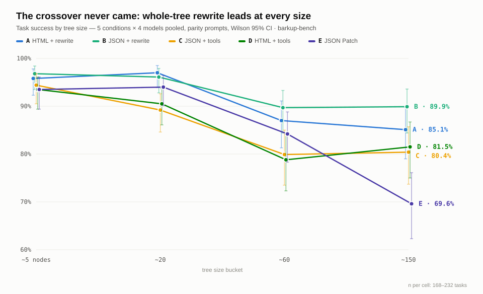
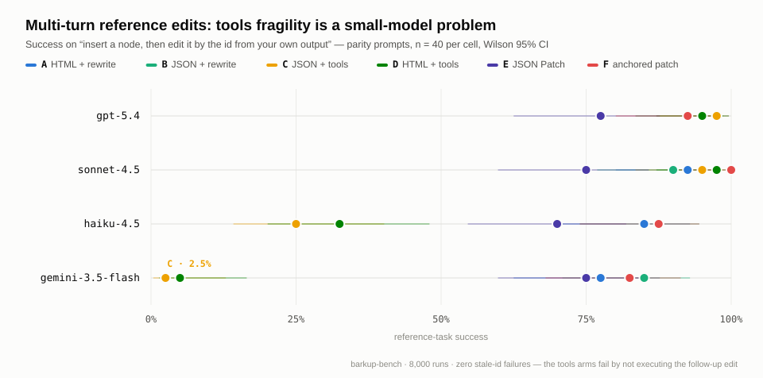

# barkup-bench

An ongoing, pre-registered benchmark series on a narrow question with
broad consequences: what is the most reliable way to let an LLM agent
edit typed trees (page layouts, document templates, CMS content)?

It began as one study comparing the
[barkup](https://github.com/kevinpeckham/barkup) approach (HTML as an
authoring dialect, edited by whole-tree rewrite) against JSON with
granular mutation tools. It has grown into forty-five studies
covering interfaces, tree size, partial context, retrieval, session
memory, multi-target edits, qualitative rewrites, and model tier
maps. Every utility in the
[`@kevinpeckham/barkup`](https://www.npmjs.com/package/@kevinpeckham/barkup)
package traces back to a study here.

**Status: active.** More than 36,000 scored runs across 8 models,
published as found. The series so far includes two major corrections
and several self-refutations, kept deliberately.

## Read the results

- **[The dashboard](https://www.lightningjar.com/research/barkup-bench)**:
  every study as its own page, with charts, tables, and
  plain-language takeaways. Start here.
- **[REPORT.md](REPORT.md)**: the full technical record, including
  the protocol-v2 correction, all audits, and every disclosed
  protocol note.
- **[The Builder's Playbook](https://www.lightningjar.com/research/barkup-bench/playbook)**:
  the practical distillation, ten action items with code examples.
- The blog arc for humans: it began with
  [HTML as a Native Data Format for LLMs](https://www.lightningjar.com/blog/ast-as-html)
  and the current capstone is
  [Hand It Everything It Needs](https://www.lightningjar.com/blog/hand-it-everything-it-needs).

<picture>
	<source srcset="docs/img/crossover-success-dark.svg" media="(prefers-color-scheme: dark)" />
	
</picture>

<picture>
	<source srcset="docs/img/reference-stability-dark.svg" media="(prefers-color-scheme: dark)" />
	
</picture>

*(Charts are from the corrected main matrix; per-study tables live in
`results/analysis-*.txt` and the REPORT addenda.)*

## The discipline

- Every study is pre-registered by commit before its first scored
  run: hypotheses, corpora, prompts, graders, gates, and a cost
  fence ([BRIEF.md](BRIEF.md) plus per-study `docs/BRIEF-*.md`).
- Results publish whatever they show. Failed gates stay published,
  with their anatomy.
- Graders are unit-tested. Corpora generate from committed seeds and
  reproduce byte-identically.

## The regression-gate suite

The series' sharpest shipped-guardrail constructions are packaged as
thirteen pass/fail gates, re-runnable against any AI Gateway model
id. This is model-swap CI: before moving a production surface to a
new model, run the suite and read which guardrail breaks.

```sh
bun run scripts/regress.ts --model <gateway-model-id>   # ~$1-35 by tier
```

Thresholds are registered in [docs/REGRESSION.md](docs/REGRESSION.md)
and never adjusted after the fact. A red gate is investigated, never
re-thresholded.

## Reproduce

```sh
bun install                          # needs AI_GATEWAY_API_KEY in .env.local
bun test                             # graders, twin validator, corpora, worked examples
bun run corpus                       # regenerate corpora from committed seeds
bun run matrix                       # full main matrix (~$225 of API spend); resumable
bun run scripts/run-study-<x>.ts     # any addendum study (resumable; a few dollars each)
bun run scripts/analyze-study-<x>.ts # its committed analysis
```

Scored runs are resumable JSONL keyed by (task, condition, model).
If you reproduce, extend, or refute any of this, we want the issue.

Sibling series: [aeo-bench](https://github.com/kevinpeckham/aeo-bench),
the same discipline pointed at website agent readiness.

MIT © Kevin Peckham
